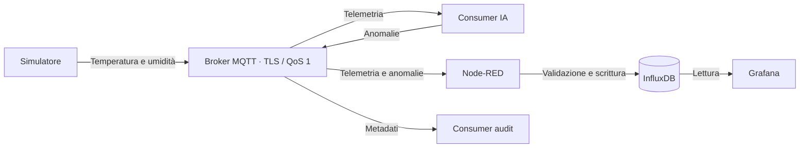

# OT-Security

Laboratorio OT su **K3s**: telemetria MQTT, rilevamento anomalie e dashboard Grafana.

**Deploy verificato il 30 settembre 2026** — [pipeline verde](https://github.com/davidevaloroso-sys/ot-security/actions/runs/36744724064), sei workload e dati recenti confermati.

## Flusso dei dati

Il simulatore pubblica su `lab/raspi1/temperature` e `lab/raspi1/humidity`. L'IA analizza le letture e pubblica gli allarmi su `lab/raspi1/anomaly`. Node-RED salva i dati validi; Grafana mostra valori, anomalie e ultima lettura per sensore.

## Dinamiche

- **Consegna:** Node-RED conferma il messaggio dopo la scrittura in InfluxDB. L'IA attende il PUBACK dell'allarme prima di confermare l'ingresso.
- **Guasti:** errori temporanei del DB attivano ritentativi; i messaggi invalidi vengono scartati per non bloccare la coda.
- **Duplicati:** QoS 1 può riconsegnare. Lo stesso punto InfluxDB viene riscritto; due letture dello stesso sensore/tipo nello stesso secondo si sovrascrivono.
- **Accessi:** MQTT usa TLS e account per ruolo. Node-RED scrive sul bucket, Grafana legge. Flussi e dashboard sono versionati nel repository.

## Dal codice al cluster

`Push main → test e training → sei build → scansioni e integrazione → GHCR → deploy K3s → collaudo`

Il runner entra via WireGuard e raggiunge l'API privata K3s. Il broker MQTT usa TLS sulla stessa VM. Il deploy verifica servizi, query Grafana e telemetria recente.

## Documentazione

- [Verifica pipeline e Dependabot del 7 ottobre 2026](docs/REPORT-2026-10-07.md)
- [Guida tecnica, comandi e test](docs/OPERATIONS.md)
- [Credenziali e preparazione del broker](docs/K3S-SECRETS.md) · [VPN e TLS](docs/K3S-TLS.md)
- [Report del deploy e limiti verificati](docs/DEPLOYMENT-2026-09-30.md) · [Checklist del laboratorio](docs/K3S-COLLAUDO.md)

Laboratorio con dati simulati. OpenPLC è opzionale e separato dal flusso; nessun attuatore è controllato.
